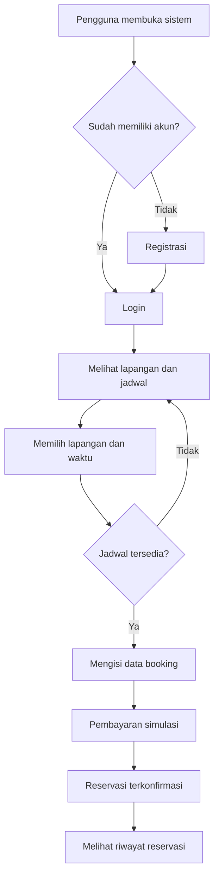

# Alur Sistem Reservasi

```mermaid
flowchart TD
    A[Pengguna membuka sistem] --> B{Sudah memiliki akun?}
    B -- Tidak --> C[Registrasi]
    B -- Ya --> D[Login]
    C --> D
    D --> E[Melihat lapangan dan jadwal]
    E --> F[Memilih lapangan dan waktu]
    F --> G{Jadwal tersedia?}
    G -- Tidak --> E
    G -- Ya --> H[Mengisi data booking]
    H --> I[Pembayaran simulasi]
    I --> J[Reservasi terkonfirmasi]
    J --> K[Melihat riwayat reservasi]
```
